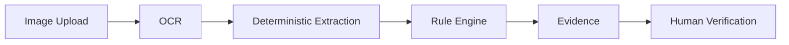
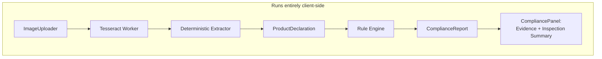

# MetroScan

**AI-assisted, deterministic compliance screening for packaged commodities — built for Smart India Hackathon (Problem Statement 26034).**

> Prototype status: client-side only, no backend, no database, no AI-made legal decisions. Every result requires human verification.

---

## Overview

MetroScan is a browser-based prototype that screens photographs of packaged-commodity labels against a subset of declaration requirements relevant to India's Legal Metrology (Packaged Commodities) framework. An inspector uploads one or more images of a package, the system reads the label text, extracts structured declaration fields, and runs a transparent, deterministic rule engine to flag what's present, what's missing, and what needs a human look.

MetroScan does **not** decide legal compliance on its own. It is a decision-support tool: OCR and extraction locate information; a plain, auditable rule engine — not an AI model — produces every PASS/FAIL/REVIEW/NOT CHECKED result.

## Problem

Under India's Legal Metrology (Packaged Commodities) Rules, 2011, pre-packaged goods must carry specific mandatory declarations — manufacturer/packer/importer details, net quantity, MRP, consumer care information, and more. Manually checking these declarations across large volumes of packaged products is slow, inconsistent, and easy to get wrong when done under time pressure. Problem Statement 26034 asks for a software system that can check this compliance by scanning products, images, and labels.

## Solution

MetroScan implements the core of that workflow as a working, demonstrable pipeline:

1. An inspector photographs (or uploads) a package from multiple angles.
2. On-device OCR reads the visible text.
3. A deterministic extractor turns raw OCR text into structured declaration fields.
4. A rule engine evaluates those fields against a prototype set of Legal Metrology declaration requirements.
5. Results are shown with full evidence — what was detected, where, and why — so a human inspector can verify and act.

Every step before "human verification" runs entirely in the browser. Nothing is sent to a server, stored in a database, or decided by a language model.

## Key Features

- Multi-image upload with role tagging (front / back / side / top / bottom / unspecified)
- Client-side OCR (Tesseract.js) with live per-image status and confidence
- Deterministic declaration extraction — no AI/LLM involved
- Deterministic compliance rule engine covering 7 declaration categories
- Full evidence trail per rule: detected value, raw OCR text, source image, source role, OCR confidence
- "Issues Requiring Attention" triage view (FAIL/REVIEW rules only)
- Client-generated Inspection ID, timestamp, and image count
- "Copy Inspection Summary" clipboard export for demo/audit purposes
- Explicit human-verification disclaimer throughout

## Pipeline



| Stage | What happens | Where |
|---|---|---|
| Image Upload | Multiple images accepted, role assigned per image, live previews | `components/scanner/ImageUploader.tsx` |
| OCR | Tesseract.js runs sequentially through a single worker; per-image status (WAITING → PROCESSING → COMPLETE/ERROR) and confidence | `lib/ocr.ts`, `components/scanner/OCRResults.tsx` |
| Deterministic Extraction | Regex/keyword matching converts OCR text into a structured `ProductDeclaration`, no AI call | `lib/extraction/` |
| Rule Engine | 7 deterministic rules evaluate the declaration, producing PASS/FAIL/REVIEW/NOT_CHECKED | `lib/rules/` |
| Evidence | Every rule result carries its detected value, raw OCR line, source image, source role, and OCR confidence | `components/scanner/CompliancePanel.tsx` |
| Human Verification | Inspector reviews the Compliance Assessment and Issues Requiring Attention before acting | — (manual step) |

## Architecture Overview



No API routes, no server-side processing, no external service calls other than Tesseract.js's one-time fetch of its own OCR core/language data. See [`docs/architecture.md`](docs/architecture.md) for the full breakdown.

## Technology Stack

| Layer | Choice |
|---|---|
| Framework | Next.js (App Router) + React + TypeScript |
| Styling | Tailwind CSS v4 (`@theme` tokens, no `tailwind.config.js`) |
| Icons | lucide-react |
| OCR | Tesseract.js (client-side, no Python, no server) |
| Extraction | Deterministic TypeScript (regex/keyword matching) |
| Compliance Logic | Deterministic TypeScript rule engine |
| Persistence | None — no database, no backend, session-only state |
| AI/LLM | Not used for any compliance decision |

## Project Structure
```text
metroscan/
├── app/
│ ├── page.tsx # Landing page
│ ├── layout.tsx # Root layout, fonts, header
│ ├── globals.css # Tailwind v4 theme tokens
│ └── scanner/
│ └── page.tsx # Scanner workflow + page state
├── components/
│ ├── layout/
│ │ └── Header.tsx
│ └── scanner/
│ ├── ImageUploader.tsx # Upload, preview, role assignment
│ ├── OCRResults.tsx # Per-image OCR status/text/confidence
│ ├── DeclarationPanel.tsx # Extracted ProductDeclaration display
│ └── CompliancePanel.tsx # Compliance report, evidence, summary
├── lib/
│ ├── ocr.ts # Tesseract worker lifecycle
│ ├── inspection.ts # Inspection ID + clipboard summary
│ ├── utils.ts # Small shared helpers
│ ├── extraction/
│ │ ├── schema.ts # ProductDeclaration, FieldEvidence, OcrChunk
│ │ ├── normalize.ts # Unit/number normalization
│ │ └── deterministicExtractor.ts
│ └── rules/
│ ├── types.ts # RuleResult, ComplianceReport
│ ├── packagedCommodityRules.ts # The 7 prototype rules
│ └── evaluateCompliance.ts
└── docs/
├── architecture.md
├── compliance-engine.md
└── inspection-workflow.md
```

## Compliance Rules (Prototype Coverage)

MetroScan currently evaluates **7 declaration categories** — a deliberate prototype subset, not the complete Legal Metrology (Packaged Commodities) Rules, 2011.

| Rule ID | Category | Result depends on |
|---|---|---|
| PC-001 | Product / Generic Name | Detected on the package |
| PC-002 | Manufacturer / Packer / Importer | At least one responsible entity identified |
| PC-003 | Address | Detected on the package |
| PC-004 | Net Quantity | Value + recognized unit (g, kg, ml, l) |
| PC-005 | Maximum Retail Price (MRP) | Valid, positive numeric value |
| PC-006 | Consumer Care Details | Contact information detected |
| PC-007 | Country of Origin | Detected where an importer declaration signals applicability |

Every rule returns one of four statuses:

| Status | Meaning |
|---|---|
| `PASS` | A valid-looking declaration was found. |
| `FAIL` | A declaration was found but is malformed or invalid. |
| `REVIEW` | Missing or ambiguous — requires manual verification of the physical package. |
| `NOT_CHECKED` | Applicability itself could not be determined from the available data. |

Full rule-by-rule logic: [`docs/compliance-engine.md`](docs/compliance-engine.md).

## Evidence & Explainability

Every rule result is designed to answer three questions for an inspector:

- **What did the system detect?** — the `detectedValue` extracted from the label
- **Where did it detect it?** — the source image filename and declared role (front/back/etc.)
- **Why this result?** — a plain-language `message`, plus the exact raw OCR line matched and its OCR confidence

`OCR confidence` is always a measure of text-recognition confidence — **never** a measure of legal correctness. This distinction is preserved throughout the UI and the exported inspection summary. FAIL and REVIEW results are visually emphasized (colored border, expanded by default) so they're impossible to miss during review.

## Installation & Local Setup

**Requirements:** Node.js 18+ and npm.

```bash
git clone <your-repo-url>
cd metroscan
npm install
npm run dev
```

Open `http://localhost:3000`, click **Start Scan**, and go to `/scanner`.

To verify a production build:

```bash
npm run build
```

No environment variables, API keys, or external service accounts are required — everything runs locally in the browser.

## Demo Workflow

1. Open the app and navigate to **Scanner**.
2. Upload one or more package images and assign roles (front/back/etc.).
3. Click **Run OCR** — watch per-image status move through WAITING → PROCESSING → COMPLETE, with OCR confidence shown.
4. Review the **Extracted Declaration** panel — each field shows its detected value or "Not detected."
5. Review the **Compliance Assessment** panel:
   - **Inspection Summary** — Inspection ID, timestamp, image count, overall status, PASS/FAIL/REVIEW/NOT CHECKED counts
   - **Issues Requiring Attention** — a compact triage list of only FAIL/REVIEW rules
   - Full rule list — expand any rule to see its evidence
6. Click **Copy Inspection Summary** to export a plain-text summary for a demo or manual record.

A full presentation script is in [`docs/demo-flow.md`](docs/demo-flow.md) if present in your checkout.

## Current Prototype Coverage

- ✅ Multi-image upload with role tagging
- ✅ Client-side OCR with per-image status and confidence
- ✅ Deterministic structured declaration extraction
- ✅ Deterministic rule engine covering 7 declaration categories
- ✅ Full evidence trail per rule result
- ✅ Client-generated Inspection ID, timestamp, and image count
- ✅ Clipboard-based inspection summary export
- ❌ No database or persistence
- ❌ No user authentication
- ❌ No PDF report generation
- ❌ No bounding-box / on-image evidence highlighting
- ❌ No AI/LLM involved in any compliance decision

## Limitations

- **Not a complete legal compliance system.** Only 7 declaration categories are checked; many statutory requirements (font-size thresholds, category-specific exemptions, penalty provisions, etc.) are not implemented.
- **OCR accuracy depends on image quality.** Blurry, low-light, or heavily stylized label text can reduce extraction accuracy — this is why every result is traceable to raw OCR text and confidence, and REVIEW is used liberally rather than guessing.
- **Deterministic extraction has known weak points**, particularly product-name detection, which uses a simple heuristic (first substantial line on the front-image text) rather than true layout understanding.
- **No persistence.** Refreshing the page or closing the tab discards all uploaded images and results — there is no database in this prototype.
- **Single-session, single-user.** No accounts, no multi-inspector workflows, no audit log beyond the in-session Inspection Summary.

## Future Scope

- PDF inspection report generation from the existing `ComplianceReport` data
- Bounding-box evidence: linking OCR word coordinates to declaration fields for on-image highlighting
- Persistent storage (e.g. Postgres/Supabase) for inspection history and case management
- An optional AI-assisted extractor as an alternative to the deterministic one, kept behind the same interface so the rule engine itself never needs to change
- Expanded rule coverage, each rule sourced and verified against the official consolidated Legal Metrology (Packaged Commodities) Rules text
- Multi-inspector accounts and role-based access, if the system moves beyond a single-session prototype

## Privacy & Data Handling

MetroScan processes everything **locally in the browser**. Uploaded images are held in memory (as browser `File`/object URLs) for the current session only and are never uploaded to a server or third-party API — OCR runs on-device via Tesseract.js. Closing or refreshing the tab discards all images, OCR results, extracted declarations, and compliance reports. Nothing is logged, stored, or transmitted outside the user's own machine.

## Legal Disclaimer

MetroScan is an **AI-assisted decision-support prototype**, not a legally binding compliance determination system. It does not represent, and should not be relied upon as, a certification of compliance or non-compliance with the Legal Metrology (Packaged Commodities) Rules, 2011 or any other applicable law. All results — PASS, FAIL, REVIEW, and NOT CHECKED — require verification by a qualified human inspector before any enforcement, reporting, or business decision is made.

## Smart India Hackathon Context

MetroScan was built as a prototype response to **SIH Problem Statement 26034**: *"Software System to check compliance of Packaged Commodities under Legal Metrology (Packaged Commodities) Rules, 2011 by scanning products, images and labels."* It is intended to demonstrate a credible technical approach — AI-assisted extraction combined with a transparent, deterministic, and explainable rule engine — within a 3–4 day prototyping timeline, not to serve as a complete or production-ready implementation of the full statutory framework.
