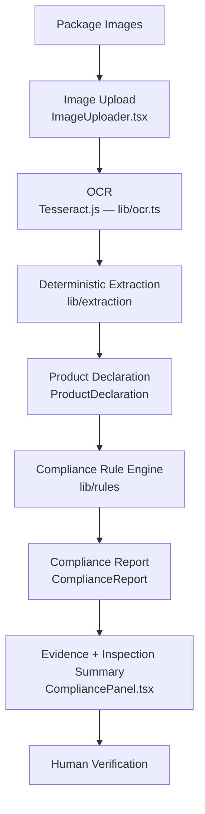

# MetroScan — Architecture

## System Overview

MetroScan is a client-side, browser-only decision-support prototype for
screening packaged-commodity labels against a subset of declaration
requirements relevant to India's Legal Metrology (Packaged Commodities)
framework. It is built for the SIH prototype timeline (3–4 days) and is
explicitly **not** a production compliance system: it has no backend, no
database, and no legally binding output. Every result requires human
verification by a qualified inspector.

The system's key design principle: **AI/OCR only extracts data; a
deterministic, explainable rule engine makes every PASS/FAIL/REVIEW
decision.** No AI/LLM is ever asked "is this compliant?" — that
determination is always computed by plain TypeScript logic operating on
structured data.

## High-Level Architecture

Everything left of "Human Verification" runs entirely in the browser. No
network calls are made except Tesseract.js's one-time fetch of its OCR
core/language data on first use.

## Component Architecture
metroscan/
├── app/
│ ├── page.tsx — landing page ("Start Scan")
│ ├── layout.tsx — root layout, fonts, <Header/>
│ ├── globals.css — Tailwind v4 @theme tokens (color, font)
│ └── scanner/page.tsx — the entire scanner workflow + page state
├── components/
│ ├── layout/Header.tsx — top nav bar
│ └── scanner/
│ ├── ImageUploader.tsx — upload, preview, role assignment, remove
│ ├── OCRResults.tsx — per-image OCR status/text/confidence
│ ├── DeclarationPanel.tsx — extracted ProductDeclaration display
│ └── CompliancePanel.tsx — compliance report, evidence, summary
└── lib/
├── ocr.ts — Tesseract worker lifecycle + recognizeImage()
├── extraction/
│ ├── schema.ts — ProductDeclaration, FieldEvidence, OcrChunk types
│ ├── normalize.ts — unit/number normalization helpers
│ └── deterministicExtractor.ts — regex/keyword extraction (no AI)
├── rules/
│ ├── types.ts — RuleResult, ComplianceReport types
│ ├── packagedCommodityRules.ts — the 7 prototype rules
│ └── evaluateCompliance.ts — runs all rules, aggregates summary
└── inspection.ts — inspection ID generation, clipboard text builder

All state lives in `app/scanner/page.tsx` (React `useState`); no global
state manager, no server state. This is a deliberate scope decision for a
3–4 day prototype.

## Data Flow

1. **Upload** — `ImageUploader` holds `UploadedImage[]` (file, preview URL,
   role) in page state.
2. **OCR** — clicking "Run OCR" iterates images **sequentially** through a
   single shared Tesseract worker (`lib/ocr.ts`), updating per-image status
   (`WAITING → PROCESSING → COMPLETE/ERROR`) and collecting `OcrChunk[]`
   (text + confidence + role + filename) locally in the run function.
3. **Extraction** — once all images are processed, `extractDeclaration()`
   converts the `OcrChunk[]` into a `ProductDeclaration` — 15 fields, each
   carrying `value`, `confidence`, and `evidence` (raw matched line, source
   image, source role).
4. **Rule Engine** — `evaluateCompliance()` runs 7 deterministic rule
   functions against the `ProductDeclaration`, producing a
   `ComplianceReport` (per-rule `RuleResult[]` + summary counts + overall
   status).
5. **Evidence & Summary** — `CompliancePanel` renders the report, an
   "Issues Requiring Attention" triage list, and an `InspectionMeta`
   (client-generated ID + timestamp + image count) with a
   "Copy Inspection Summary" clipboard action.

## OCR Layer (`lib/ocr.ts`)

- Single module-level singleton Tesseract worker — never more than one
  worker instance at a time.
- Worker created lazily on first "Run OCR" click, not on page load.
- Terminated via `useEffect` cleanup when the scanner page unmounts.
- Runs entirely client-side; no server-side OCR, no Python.

## Extraction Layer (`lib/extraction/`)

- Fully deterministic: regex + keyword line-matching, no AI/LLM call.
- Designed so a future AI-assisted extractor could be substituted behind
  the same `(chunks: OcrChunk[]) => ProductDeclaration` signature without
  touching the rule engine or UI.
- Every extracted field preserves its evidence (raw OCR line, source
  image, source role) so results are always traceable back to a specific
  photo.

## Rule Engine (`lib/rules/`)

- See `compliance-engine.md` for the full rule-by-rule specification.
- Pure functions: `(declaration: ProductDeclaration) => RuleResult`. No
  dependency on OCR, extraction internals, or any UI component.

## UI Layer

- Next.js App Router, Tailwind CSS v4 (`@theme` tokens in `globals.css`,
  no `tailwind.config.ts`), Inter + IBM Plex Mono, restrained
  off-white/charcoal palette with green/amber/red/gray reserved strictly
  for status meaning.

## Inspection Evidence Layer (`lib/inspection.ts` + `CompliancePanel.tsx`)

- Client-side-only `InspectionMeta` (ID + ISO timestamp + image count),
  generated once per completed run — not persisted anywhere.
- "Issues Requiring Attention" filters the report to FAIL/REVIEW only.
- Each rule result renders as an expandable `
` element; FAIL/REVIEW
  rows are open by default and carry a colored left border for visual
  prominence, PASS/NOT_CHECKED rows are collapsed by default.

## Current Client-Side Architecture

No backend. No database. No authentication. Nothing is persisted between
page loads — refreshing the browser clears all state by design. This is
appropriate for a live demo but not for real inspection record-keeping.

## Future Backend Architecture (not built — reference only)

If MetroScan moved beyond prototype stage, a natural next architecture
would add (in rough priority order): a persistence layer (Postgres/Supabase)
for `inspections`, `inspection_images`, `extracted_declarations`,
`compliance_checks`, and `reports` tables; PDF report generation from the
existing `ComplianceReport` shape; bounding-box evidence (tying OCR word
boxes to declaration fields for on-image highlighting); and an
AI-assisted extractor as an alternative to the deterministic one, kept
behind the same interface so the rule engine never changes. None of this
exists today — it is listed here only to show the current architecture
was designed with these extension points in mind.