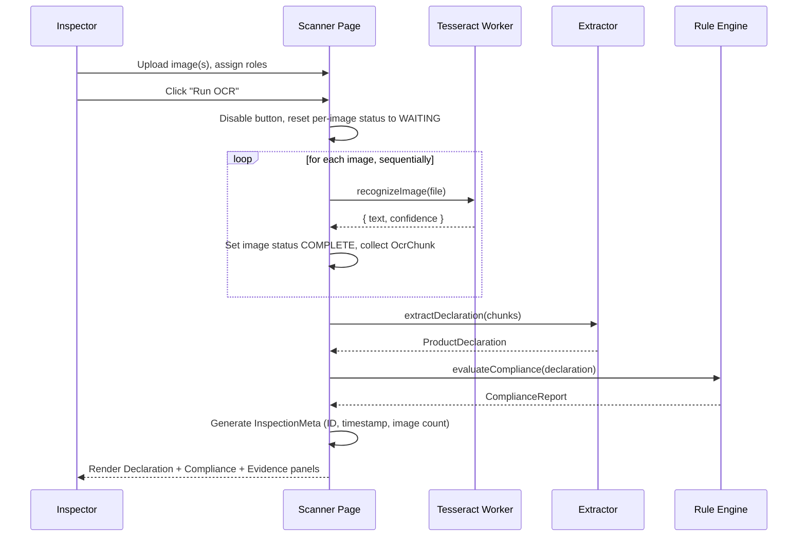

# MetroScan — Inspection Workflow

This documents the actual runtime behavior of `app/scanner/page.tsx`,
step by step, including how edge cases are handled.

## Happy Path



## Worker Lifecycle

- A single Tesseract worker is created **lazily** on the first "Run OCR"
  click (module-level singleton in `lib/ocr.ts`) — never on page load.
- The same worker processes every image in the batch **sequentially**
  (a `for...of` loop, not `Promise.all`) — this avoids spinning up
  multiple Tesseract workers at once.
- The worker is terminated via a `useEffect` cleanup function when the
  scanner page unmounts (navigating away).
- Clicking "Run OCR" again re-creates the worker if it was previously
  terminated, or reuses it if still alive.

## Edge Case Handling

| Scenario | Behavior |
|---|---|
| No images uploaded | "Run OCR" button is disabled (`images.length === 0`) |
| One image uploaded | Processes normally; extraction/rules run on the single chunk |
| Multiple images uploaded | Processed sequentially in upload order |
| OCR fails on one image | That image's status → `ERROR` with a message; the loop **continues** to the next image; extraction runs on whatever chunks succeeded |
| OCR fails on all images | `collectedChunks` is empty; `extractDeclaration([])` returns an all-null declaration (checked explicitly, no crash); every rule correctly reports `REVIEW`/`NOT_CHECKED` rather than crashing or false-passing |
| OCR returns empty text | Chunk is still collected with empty string; extraction simply finds no matches for that chunk's lines |
| Missing declaration field (MRP, quantity, manufacturer, consumer care, country of origin, etc.) | Corresponding rule returns `REVIEW` (or `NOT_CHECKED` for country of origin with no importer signal) — never silently marked compliant |
| Re-running OCR | All per-image statuses, the declaration, the compliance report, and the inspection metadata are cleared and regenerated from scratch; button label switches to "Re-run OCR" after the first run |
| Removing an image (before or after a run) | UI reads from the live `images` array; any stale result entry for a removed image's ID is simply never rendered — no lookup crash |
| Clipboard copy fails (permissions/insecure context) | Caught silently; the rest of the panel remains fully functional |

## Inspection Metadata

Generated **once per completed run**, immediately after the compliance
report is computed — not on every render, and not incrementally during
the OCR loop:

```typescript
setInspectionMeta({
  inspectionId: generateInspectionId(),   // e.g. INS-2026-08-27-9F3K
  timestamp: new Date().toISOString(),
  imageCount: images.length,
});
```

This metadata is **not persisted** — refreshing the page or starting a
new run discards it. There is no database in this prototype.